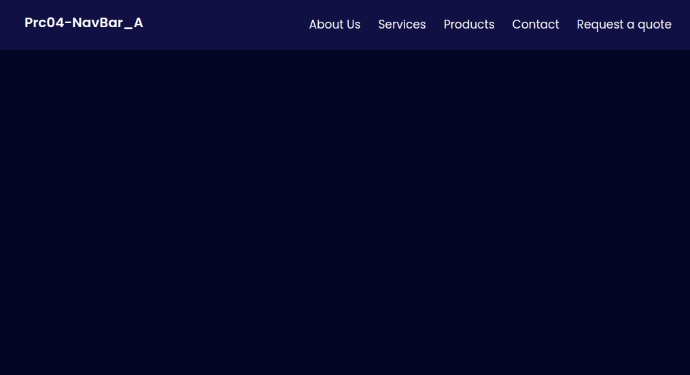
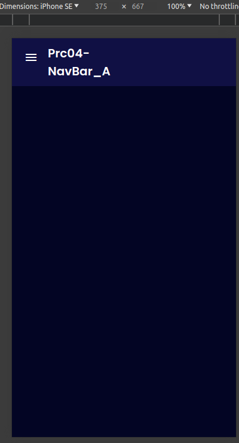
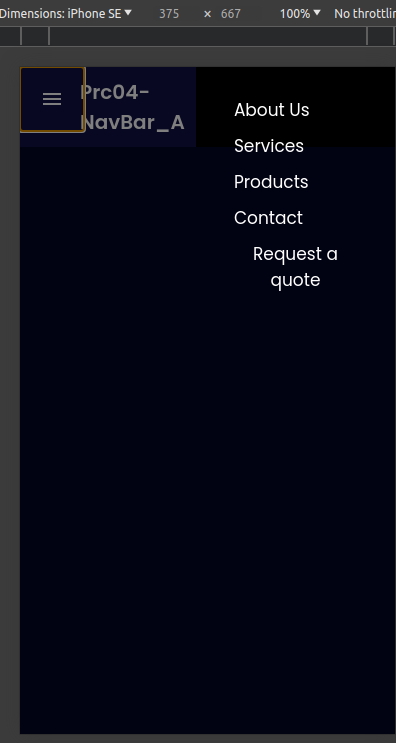

# Simple NavBar
Lets make a simple and responsive Navbar template.

## Branches dev1 and dev2
In these branches the code is split in two parts, the HTML one which was developed on the dev1 branch and the style on the dev2 branch.

## Branches joint, QA and Main
These Branches were merged and will look as follow:

# Code analysis

## HTML File

### Summary:
This creates a navigation bar estructure with a hamburger menu icon, which displays the menues when is clicked.

### Code:
We start defining a navigation bar with a class of **"navbar"**, which contains a **div** element with a class of **"navbar-overlay"** that, when clicked, calls the **toggleMenuOpen() JavaScript function**. 
This overlay is likely used to provide a clickable area for opening or closing a menu.

It continues with the class **"navbar-burger"**. 
When this button is clicked, it triggers the **JavaScript function "toggleMenuOpen()"**. 
Inside the button, there is a **span** element with the class **"material-icons"** that displays the menu icon.

It continues defining a navigation menu, which contains five buttons, each representing a different section of the website.
The **navbar-menu class** is used to style the entire navigation menu, and the **active class** is used to indicate that each button is currently active.

## CSS File

### Code:

**@import url('https://fonts.googleapis.com/css2?family=Poppins:wght@300;400;500;600&display=swap');** 
    * This line imports the Poppins font from Google Fonts. 
    The **@import** rule is used to include external stylesheets. 
    In this case, the stylesheet is hosted on Google Fonts and the font being imported is Poppins with different weights (300, 400, 500, 600). 
    The **url() function** is used to specify the location of the external stylesheet.